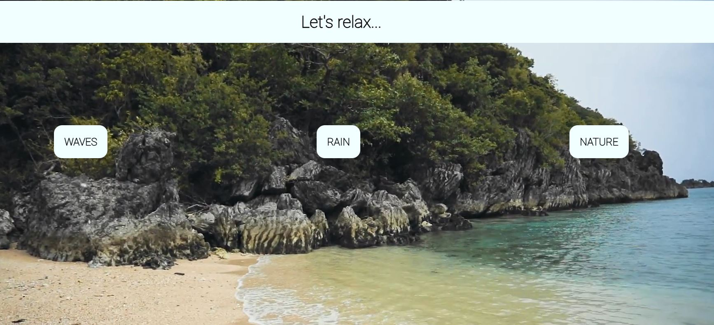

# Meditation App

## Demo  
🔗 [View the app on Glitch](https://meditation-lilia.netlify.app/)

## Project Description

This app allows you to choose one of three meditation sessions: **waves**, **rain**, or **nature**.  
The app is built using HTML, CSS, and JavaScript.  

Select a meditation, relax, and enjoy soothing video and music.  
Meditation durations:  
- **Waves** — 3 minutes  
- **Rain** — 2 minutes  
- **Nature** — 1 minute  

No installation is required.

## Here's what the app looks like:

### How to Use:
1. Choose one of the three meditations.
2. Click the **"Start"** button.
3. The timer will start, and the music will begin playing. When the timer ends, the music will stop.

### Features:
- Starting the timer and music, as well as the countdown, are handled by JavaScript.
- Automatic music stop when the timer ends.
- Intuitive user interface.

## Requirements
- A modern web browser with JavaScript support.

